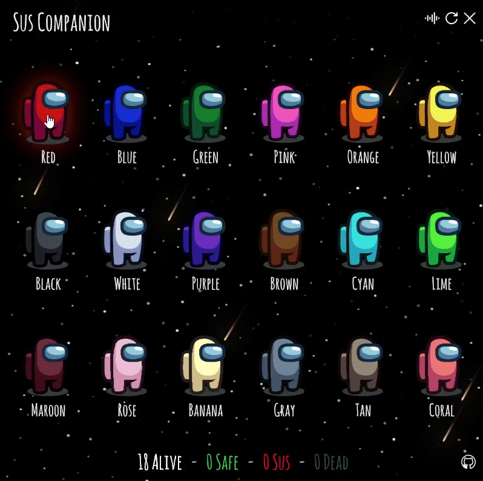

# Sus Companion

Sus Companion is a **portable desktop app** that helps crewmates track who's sus and who's safe!  

---

## 📥 Download

No installation required:

1. [Download the latest version][direct-download]
2. Launch `Sus Companion.exe`
3. You're good to go!

> Or grab it from the [release page][release-page]

---

## 🎮 How to Use

- 🖱 **Left-click** a crewmate to cycle:
  -  → **Safe**
  -  → **Sus**
  -  → **Unknown**
- 🖱 **Right-click** a crewmate to toggle between:  
  -  → **Dead**
  -  → **Alive**
- ↻ **Click the Refresh button** (top right) to reset all states.

---

## 📺 Video Tutorial

---

## 📦 Built With

- WPF (Windows Presentation Foundation)  
- C# (.NET 9.0)  
- XAML  

---

## 🤝 Contributing  

⭐ Star the repo if you like it!  
💬 Got feedback? [Open an issue](https://github.com/lucas-jammes/SusCompanion/issues)  

---

## 📜 License

Licensed under **GNU General Public License v3.0** - [Learn more](https://www.gnu.org/licenses/gpl-3.0.en.html)

---

[release-page]: https://github.com/lucas-jammes/SusCompanion/releases/latest "Latest release"  
[direct-download]: https://github.com/lucas-jammes/SusCompanion/releases/download/v1.4.0/Sus_Companion.exe "Direct download"  

<!-- Maintenance badge generator: https://gist.github.com/taiki-e/ad73eaea17e2e0372efb76ef6b38f17b -->  
